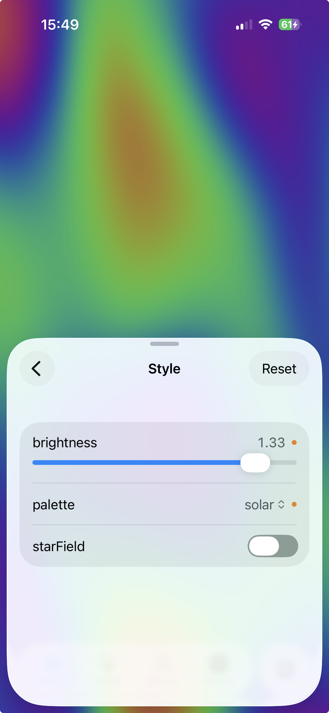
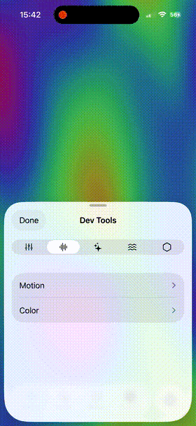

# DevTweaks

**Adjust anything at runtime. Ship nothing to production.**

DevTweaks is a spiritual successor to [SwiftTweaks](https://github.com/bryanjclark/SwiftTweaks) — the beloved library that let you fine-tune your app without recompiling. DevTweaks brings that same magic to modern SwiftUI with a declarative DSL, real-time editing, and zero production overhead.

<p align="center">
  
</p>

## Why?

Because recompiling to change an animation duration by 0.05 seconds is a crime against your time.

DevTweaks lets you define tweakable parameters once and get a full debug panel for free. Drag sliders, flip toggles, pick options — see changes instantly without a rebuild.

<p align="center">
  
</p>

## Features

- **Declarative DSL** — Define tweaks with result builders. Types infer the controls automatically.
- **Real-time editing** — Sliders, toggles, text fields, pickers, steppers, and action buttons.
- **Swipe to reset** — Changed a value? Swipe any row to snap it back to its default.
- **Modification tracking** — Orange dots show what you've changed at a glance.
- **Custom tabs** — Add your own SwiftUI views alongside the built-in tweaks browser.
- **Floating button + gesture** — Tap the button or two-finger double-tap anywhere to open.
- **Section master toggles** — Enable/disable entire feature flag groups with one switch.
- **`#if DEBUG` safety** — All UI code compiles away in release builds. `TweakRef` returns compile-time defaults with zero overhead.

## Quick Start

### 1. Define your tweaks

```swift
import DevTweaks

enum AppTweaks {
    static let store = TweakStore {
        TweakCategory("Animations", icon: "sparkles") {
            TweakSection("Spring") {
                TweakDefinition("duration", default: 0.46, range: 0.1...2.0)
                TweakDefinition("damping", default: 0.8, range: 0.1...1.0)
            }
        }
        TweakCategory("Debug", icon: "ladybug") {
            TweakSection("Network") {
                TweakDefinition("mockMode", default: false)
                TweakDefinition("endpoint", default: "production",
                                options: ["production", "staging", "local"])
            }
        }
    }
}
```

### 2. Install the panel

```swift
#if DEBUG
TweakPanel.install(store: AppTweaks.store)
#endif
```

### 3. Read values

```swift
let duration: CGFloat = AppTweaks.store["Animations.Spring.duration"]
```

That's it. The panel appears via a floating button or two-finger double-tap.

## Control Types

The control is inferred from your default value and parameters:

| Definition | Control |
|---|---|
| `TweakDefinition("flag", default: true)` | Toggle |
| `TweakDefinition("speed", default: 0.5, range: 0.0...1.0)` | Slider |
| `TweakDefinition("columns", default: 3)` | Stepper |
| `TweakDefinition("columns", default: 3, range: 1...10)` | Integer slider |
| `TweakDefinition("name", default: "hello")` | Text field |
| `TweakDefinition("env", default: "prod", options: ["prod", "staging"])` | Picker |
| `TweakDefinition("reset", action: { ... })` | Action button |

Action buttons don't store a value — they fire a closure on tap. Great for debug shortcuts like resetting state or clearing caches.

## TweakRef — Typed Handles

For ergonomic access, `TweakRef` gives you a typed handle with modification tracking:

```swift
static let duration: TweakRef<CGFloat> = store.ref("Animations.Spring.duration")

// Read/write:
AppTweaks.duration.value        // 0.46
AppTweaks.duration.value = 0.5
AppTweaks.duration.isModified   // true
AppTweaks.duration.reset()      // back to 0.46
```

In release builds, `.value` returns the compile-time default directly — zero overhead.

## Custom Tabs

Add your own panels alongside the built-in tweaks browser:

```swift
TweakPanel.install(
    store: AppTweaks.store,
    tabs: [
        TweakTab("Actions", icon: "bolt") { ActionsView() },
        TweakTab("Stats", icon: "chart.bar") { StatsView() },
    ]
)
```

## Installation

**Swift Package Manager:**

```
https://github.com/warpling/DevTweaks.git
```

iOS 16+ · Swift 5.9+ · Zero dependencies

## Acknowledgments

DevTweaks is a spiritual successor to [SwiftTweaks](https://github.com/bryanjclark/SwiftTweaks) by [Bryan Clark](https://github.com/bryanjclark), which pioneered the idea of runtime-tweakable parameters for iOS. SwiftTweaks was a joy to use and a huge inspiration — DevTweaks aims to carry that torch forward with a modern Swift DSL and SwiftUI.

## License

MIT. See [LICENSE](LICENSE) for details.
