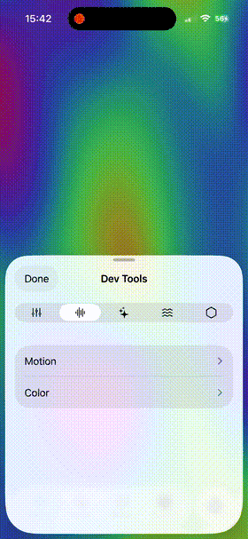

# TweakIt

**Adjust anything at runtime. Ship nothing to production.**

TweakIt is a spiritual successor to [SwiftTweaks](https://github.com/bryanjclark/SwiftTweaks) — the beloved library that let you fine-tune your app without recompiling. TweakIt brings that same magic to modern SwiftUI with a declarative DSL, real-time editing, and zero production overhead.

<p align="center">
  &nbsp;&nbsp;
  &nbsp;&nbsp;
  
</p>

## Why?

Because recompiling to change an animation duration by 0.05 seconds is a crime against your time.

TweakIt lets you define tweakable parameters once and get a full debug panel for free. Drag sliders, flip toggles, pick options — see changes instantly without a rebuild.

## Features

- **Declarative DSL** — Define tweaks with result builders. Types infer the controls automatically.
- **Real-time editing** — Sliders, toggles, text fields, pickers, steppers, and action buttons.
- **Swipe to reset** — Changed a value? Swipe left on any row to snap it back to its default.
- **Groups & descriptions** — Sub-headings inside a section, plus a one-line gloss under any cryptic name.
- **Quick Access** — Pin tweaks (swipe right) and they float to the top of the panel, live and editable.
- **Modification tracking** — Orange dots show what you've changed at a glance.
- **Custom tabs** — Add your own SwiftUI views alongside the built-in tweaks browser.
- **Floating button + gesture** — Tap the button or two-finger double-tap anywhere to open. Bring your own button if the default circle doesn't match your app.
- **Section master toggles** — Enable/disable entire feature flag groups with one switch.
- **Release-safe by default** — When disabled, all APIs no-op and `TweakRef` returns defaults directly. Active in `DEBUG` builds automatically, or opt-in for any build config with one line: `TweakIt.isEnabled = true`.

## Quick Start

### 1. Define your tweaks

```swift
import TweakIt

enum AppTweaks {
    static let store = TweakStore {
        TweakCategory("Animations", icon: "sparkles") {
            TweakSection("Spring") {
                TweakDefinition("duration", default: 0.46, range: 0.1...2.0)
                TweakDefinition("damping", default: 0.8, range: 0.1...1.0)
            }
        }
        TweakCategory("Debug", icon: "ladybug") {
            TweakSection("Network") {
                TweakDefinition("mockMode", default: false)
                TweakDefinition("endpoint", default: "production",
                                options: ["production", "staging", "local"])
            }
        }
    }
}
```

### 2. Install the panel

```swift
#if DEBUG
TweakPanel.install(store: AppTweaks.store)
#endif
```

> **Internal/TestFlight builds:** Set `TweakIt.isEnabled = true` before calling `install()` to enable tweaks in any build config. This works regardless of SPM limitations — no special compiler flags needed on the package itself.

### 3. Read values

```swift
let duration: CGFloat = AppTweaks.store["Animations.Spring.duration"]
```

That's it. The panel appears via a floating button or two-finger double-tap.

## Control Types

The control is inferred from your default value and parameters:

| Definition | Control |
|---|---|
| `TweakDefinition("flag", default: true)` | Toggle |
| `TweakDefinition("speed", default: 0.5, range: 0.0...1.0)` | Slider |
| `TweakDefinition("columns", default: 3)` | Stepper |
| `TweakDefinition("columns", default: 3, range: 1...10)` | Integer slider |
| `TweakDefinition("name", default: "hello")` | Text field |
| `TweakDefinition("env", default: "prod", options: ["prod", "staging"])` | Picker |
| `TweakDefinition("reset", action: { ... })` | Action button |

Action buttons don't store a value — they fire a closure on tap. Great for debug shortcuts like resetting state or clearing caches.

## Groups & Descriptions

A section that grew past a dozen tweaks stops being scannable. `TweakGroup` gives it sub-headings, and `description:` gives any tweak a one-line gloss — because `ignoreEngagedFloor` means nothing six months later:

```swift
TweakSection("Modal Cards") {
    TweakDefinition("enabled", default: true)

    TweakGroup("Shape") {
        TweakDefinition("cornerRadius", default: 12.0, range: 0...40)
        TweakDefinition("shadowRadius", default: 8.0, range: 0...40,
                        description: "blur radius, not the offset")
    }

    TweakGroup("Physics") {
        TweakDefinition("gravity", default: 1.0, range: 0...4)
    }
}
```

Each group renders as its own headed block in the panel. Tweaks declared bare — like `enabled` above — form an implicit headerless run, so you can interleave loose tweaks and groups in whatever order reads best.

**A group name is not part of the storage key.** `"Visual.Modal Cards.cornerRadius"` is the key whether or not `cornerRadius` sits in a group, so you can tidy up an existing section without resetting values anyone has dialled in on a device.

Descriptions render as small monospaced secondary text under the name — a phrase, not a paragraph. A tweak without one looks exactly as it always did; nothing reserves empty space.

## Quick Access

Hunting three levels down for the one slider you're iterating on gets old fast. The top of the panel holds a **Quick Access** section: tweaks you've pinned, followed by ones you've recently edited.

- **Swipe right on any row to pin or unpin it.** (Swipe left is still reset.)
- The rows are the real controls, not shortcuts — drag the slider right there without opening its section.
- A small monospaced breadcrumb under each row says where it actually lives (`Visual · Modal Cards`).
- Pins are yours and persist; recents are the last few keys you touched and look after themselves.

Nothing to configure — the section appears once there's something to put in it, and hides while you're searching.

## TweakRef — Typed Handles

For ergonomic access, `TweakRef` gives you a typed handle with modification tracking:

```swift
static let duration: TweakRef<CGFloat> = store.ref("Animations.Spring.duration")

// Read/write:
AppTweaks.duration.value        // 0.46
AppTweaks.duration.value = 0.5
AppTweaks.duration.isModified   // true
AppTweaks.duration.reset()      // back to 0.46
```

In release builds, `.value` returns the compile-time default directly — zero overhead.

## Custom Tabs

Add your own panels alongside the built-in tweaks browser:

```swift
TweakPanel.install(
    store: AppTweaks.store,
    tabs: [
        TweakTab("Actions", icon: "bolt") { ActionsView() },
        TweakTab("Stats", icon: "chart.bar") { StatsView() },
    ]
)
```

## Custom Button

Don't want a floating gray circle that clashes with your app? Supply your own button:

```swift
TweakPanel.install(
    store: AppTweaks.store,
    buttonAlignment: .bottomTrailing,
    buttonInset: 24,
    buttonIgnoresSafeAreaEdges: .bottom
) { present in
    Button(action: present) {
        Image(systemName: "slider.vertical.3")
            .font(.system(size: 17, weight: .medium))
            .frame(width: 44, height: 44)
            .contentShape(Rectangle())
    }
    .buttonStyle(.plain)
    .background(.thinMaterial, in: Circle())
}
```

`buttonIgnoresSafeAreaEdges: .bottom` measures `buttonInset` from the physical bottom edge instead of the safe area, clearing the home indicator while the sides stay safe-area-relative. Do it on all four edges instead and you'll get away with it in portrait, then watch the button drift out of alignment with the rest of your chrome the moment someone rotates to landscape.

TweakIt still owns the window, visibility, and shake-to-toggle — you just style and place the button. One catch: whatever view you return is exactly the tappable region, so size it to the control with `.frame`/`.contentShape` rather than padding around it, or you'll get an invisible dead zone that eats touches.

Don't want a button at all? Pass `{ _ in EmptyView() }` and call `TweakPanel.present()` from your own UI.

## Shake to Toggle

By default, shaking the device toggles the floating button's visibility. This uses method swizzling on `UIWindow.motionEnded(_:with:)` (scoped to `UIWindow` only, debug builds only).

If you prefer to avoid swizzling, disable it and trigger the button yourself:

```swift
TweakPanel.install(store: AppTweaks.store, shakeToToggleButton: false)
```

You can then toggle the button programmatically via `TweakPanel.buttonState`:

```swift
// In your own shake handler or gesture recognizer:
TweakPanel.buttonState?.toggle()
```

## Upgrading from 1.0

Nothing to change in your code — the DSL, keys, and stored values are all unchanged. Three things look different in the panel:

- **Categories now start collapsed.** Expanding one is remembered across launches, so the category you're working in stays open. (The old "collapsed categories" preference is discarded rather than migrated — carrying it over would have restored exactly the everything-expanded state this replaces.)
- **A Quick Access section appears at the top** once you've pinned or edited something.
- **The panel follows the system appearance** instead of forcing dark. It used to force a dark SwiftUI environment inside a sheet whose chrome kept following the system, which on a light-mode device meant white text on light glass.

## Installation

**Swift Package Manager:**

```
https://github.com/warpling/TweakIt.git
```

iOS 16+ · Swift 5.9+ · Zero dependencies

## Acknowledgments

TweakIt is a spiritual successor to [SwiftTweaks](https://github.com/bryanjclark/SwiftTweaks) by [Bryan Clark](https://github.com/bryanjclark), which pioneered the idea of runtime-tweakable parameters for iOS. SwiftTweaks was a joy to use and a huge inspiration — TweakIt aims to carry that torch forward with a modern Swift DSL and SwiftUI.

## License

MIT. See [LICENSE](LICENSE) for details.
